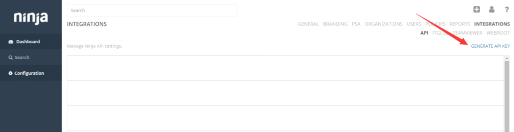
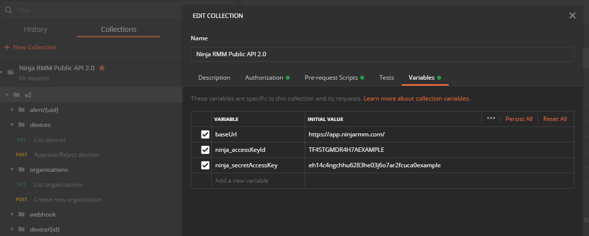

# postman-ninjarmm
Postman collection for accessing [Ninja RMM APIs](https://www.ninjarmm.com/dev-api/#introduction) using the custom authentication headers.

The Ninja authentication requirement doesn't easily lend itself to the more traditional authorization options found in  API client tools such as [Postman](https://www.postman.com/) or [Insomnia](https://insomnia.rest/).

> The NinjaRMM REST API uses a custom HTTP scheme based on a keyed-HMAC (Hash Message Authentication Code) for authentication. To authenticate a request, you first concatenate selected elements of the request to form a string. You then use your API secret access key to calculate the HMAC of that string.

This project is an attempt to eliminate this pain-point, and provides a Postman pre-script option to build the required auth headers based on your Ninja api keys.

The easiest method to get started with this project is to launch the `Run in Postman button` below.  The collection contains the latest [Ninja Api 2.0 yaml](https://app.ninjarmm.com/apidocs/) definitions at the time of this post.

> You must update the Collection variables with your own API Keys!

You can also download the [Collection](./nina-rmm-api-2-collection.json) export directly, or the [pre-script](./pm-ninja-pre-request.js) file if that's all you need.

These are the Postman variables **you will need to configure**:
 1) baseUrl - defaults to https://app.ninjarmm.com/
 2) ninja_accessKeyId
 3) ninja_secretAccessKey

## Ninja API Keys
The access keys can be found in your main NinjaRMM portal, under Configuration -> Integrations -> API

## Setup Postman Variables

Variables allow you to store and reuse values in your requests and scripts.  This script will use variables defined at the Global, Collection, Environment, or Local scopes.  They Ninja keys are defaulted to the sample values used in their documentation.

To edit a variable for this collection, select the collection in Collections on the left of the Postman app, open the View more actions (...) menu, and click Edit.

## Postman Pre-Request scripts
Postman provides a runtime based on Node.js that allows to add dynamic behavior to requests.  

The `pm-ninja-pre-request` script retrieves the key variables and constructs the authentication and date header for each request. 

The script includes comments that should give enough details for each step used in construct & sign the request signature needed. The Ninja resource that provides the example code for signing requests can be found the ref's below.

## Ref's
[Ninja API Authentication](https://www.ninjarmm.com/dev-api/)  
[Ninja API 2.0 docs](https://app.ninjarmm.com/apidocs/)  
[Postman Download](https://www.postman.com/downloads/)  
[Postman pre-request scripts](https://learning.postman.com/docs/writing-scripts/pre-request-scripts/)  
[Postman sandbox - script refs](https://learning.postman.com/docs/writing-scripts/script-references/postman-sandbox-api-reference/)  